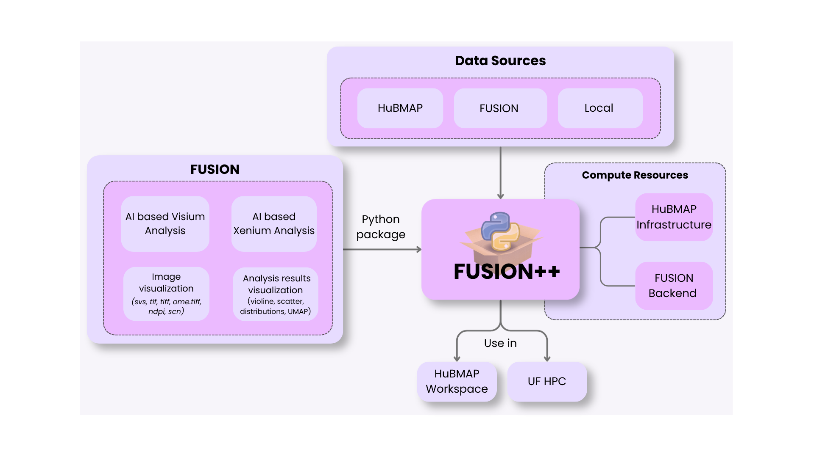

# FUSION++ 

> A Python-packaged version of FUSION in the JupyterHub interface for spatial multi-omics analysis with seamless HuBMAP data integration.

---

## Overview

FUSION++ brings together the full spatial biology analysis pipeline — from raw data access to interactive visualization — inside a collaborative JupyterHub notebook environment. Whether you're a biologist exploring kidney tissue, a bioinformatician running segmentation workflows, or a data scientist building custom visualizations, FUSION++ provides the tools to work together in a single, secure, reproducible environment.




---

## Key Features

**Easy Data Access**
Direct integration with the HuBMAP Data Portal lets you fetch datasets using a single HuBMAP ID — no manual downloads or tool setup required.

**Streamlined Workflow**
A guided, step-by-step notebook walks you from data fetch → analysis → visualization → annotation → custom plotting. Each section is self-contained and collapsible for easy navigation.

**Custom Visualization**
Go beyond default plots. FUSION++ supports richly customizable outputs, including spatial overlays, volcano plots, heatmaps, and cell-type composition charts — all built on your own analysis results.

**Diverse Collaboration**
Biologists, bioinformaticians, and data scientists can work side-by-side in the same JupyterHub notebook, with built-in documentation and flowcharts that make the platform an effective teaching resource.

**Secure Enclave**
All data and analysis outputs are persisted privately within your workspace. Your data never leaves your environment.

**Training Platform**
The notebook's integrated flowcharts, documentation, and step-by-step structure make it an excellent resource for teaching spatial multi-omics workflows.

---

## Installation

**From a terminal:**
`pip install "git+https://github.com/SarderLab/fusion-packages.git"`

**From inside a Jupyter notebook:**
`!pip install "git+https://github.com/SarderLab/fusion-packages.git"`

**Using the pre-configured kernel *(coming soon)*:** A dedicated kernel with all dependencies pre-installed will be published shortly — no manual installation needed.


---

## Quick Start

After installation, simply import `fusion` in your notebook. This will automatically download a demo notebook pre-configured and ready to use.

---

## Notebook Walkthrough

<!-- PLACEHOLDER: Notebook screenshot with Visualization tab open -->
<!-- Replace the line below with your notebook screenshot -->


The demo notebook is organized into clearly labeled, collapsible sections:

### Section 1 — Initial Setup & Authentication

Run the setup cell to install dependencies, then authenticate with your FUSION platform credentials.

### Section 2 — Select Your HuBMAP Dataset

Browse the [HuBMAP Data Portal](https://portal.hubmapconsortium.org/) and copy the unique HuBMAP ID of the dataset you want to work with. Paste it into the designated cell in the notebook to point all downstream sections at your chosen data.

### Section 3 — Data Management

With just a few function calls, you can inspect the files available in your dataset, download histology images and Visium files directly to your workspace, and push data to the FUSION backend for platform-side processing. You can also download specific items from the FUSION platform back to your workspace at any time.

### Section 4 — Run Analysis Jobs

Launch any analysis pipeline with a single function call, choosing to run either locally in the HuBMAP Workspace or on the FUSION Platform for heavier compute. Available workflows:

| # | Workflow | Description |
|---|----------|-------------|
| 1 | Multi-Compartment Segmentation | Segments WSIs into 6 tissue compartments (cortical interstitium, medullary interstitium, non-sclerotic glomerulus, sclerotic glomerulus, tubule) |
| 2 | Frozen Glomerulus Segmentation | Segments frozen tissue sections into individual glomeruli |
| 3 | Expanded Granular Feature Extraction | Extracts 72 morphometric features per FTU (Functional Tissue Unit) |
| 4 | Label Transfer | Predicts cell type composition (L1/L2) for each Visium spot using a reference atlas |
| 5 | Spot Annotation | Aligns Visium spots to the WSI and embeds cellular information |
| 6 | Spatial Aggregation | Aggregates FTUs with generated spot data for downstream analysis |

### Section 5 — Visualization

Interactively explore segmentation results and spatial data directly in the notebook. The visualization tab lets you overlay analysis outputs on whole-slide images and inspect FTU-level annotations without leaving your workspace.

---

## Custom Plots

FUSION++ provides a fully flexible coding environment to bring your own analyses and produce publication-ready figures tailored to your research questions.


---

## Output File Structure

All analysis outputs are organized automatically under your workspace:

```
fusion_demo_notebooks/
├── fusion_demo.ipynb
└── datasets/
    ├── HuBMAP_ID_1/
    │   ├── (downloaded files: images, h5ad, etc.)
    │   ├── Segmented_FTU/        # segmentation outputs
    │   ├── Aggregated_FTU/       # spatial aggregation outputs
    │   └── Files/                # all other plugin-generated files
    ├── HuBMAP_ID_2/
    │   └── ...
    └── HuBMAP_ID_N/
        └── ...
```

---

## Links

- **HuBMAP Data Portal:** [portal.hubmapconsortium.org](https://portal.hubmapconsortium.org/)
- **FUSION Platform:** [fusionpub.rc.ufl.edu](https://fusionpub.rc.ufl.edu)
- **Source Code:** [github.com/SarderLab/fusion-packages](https://github.com/SarderLab/fusion-packages)

---

## Notes

- All data and notebook outputs are persisted across sessions — your workspace state is preserved when you return.
- Model and reference files can be downloaded directly via `run_analysis('notebook', gc=gc)`.
